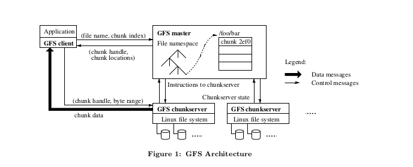

<h1 align="center">The Google File System</h1>
<h3 align="center">Sanjay Ghemawat,Howard Gobioff,and Shun-Tak Leung</h3>
<h4 align="right">Translator:Tsand</h4>
<h4 align="right">Begin Time:2019/4/25</h4>
<h4 align="right">End Time:~~~~       </h4>

 

## ABSTRACT
> 我们已经设计和实现的谷歌文件系统：一个针对大型数据密集型应用的分布式系统。即使运行在不昂贵的商业硬件上上她也表现出很好的容错性，与此同时她在大量客户端上显示出很高的性能。

> 尽管像先前分布式文件系统那样有很多相同目标，我们的设计源于对我们应用的工作负载，技术环境的观察，从当前和期盼角度，这都体现了与一些早期文件系统模型的标志性区别。这让我们得以重新检查传统的方案和有效的探索不同的设计点。

> 该文件系统成功的满足了我们的存储需求。她被谷歌广泛的用于由我们服务器产生和处理数据的存储平台以及调研及开发那些需要大数据节点的应用。最大的数据簇提供经过超过一千台机器上的上万块硬盘数以万计T字节的存储，也被上前台服务器并发的访问。

> 在这篇论文中，我们描述设计用于分布式应用的文件系统的表面扩展，谈及我们设计的许多方面并且报告理论实验室和现实使用的评测。

## Categories and Subject Descriptors

> D[4]:3--Distributed file systems

## General Terms

> Design ,reliability, performance,measurement

## Keywords

> Fault tolerate,scalability,data storage,clustered storage

## 1. INTRODUCTION

> 我们设计和实现的谷歌文件系统满足谷歌日益快速增长的数据处理需求。GFS拥有之前分布式文件系统的很多目标例如：表现，可扩展性，可靠性和实用性。但是她的设计源于我们对我们应用的工作负载技术环境的关键观察。从当前和预期角度都与之前的文件系统模型有着很大区别。我们已经重新检查传统的选择点并且探索出在设计方面更加实用的方案。

> 首先，组件错误是常态而不是例外。该文件系统由上千台甚至上万台由并不昂贵的商业零件组成并被大量客户端机器并发访问。组件的数量及质量表明有些在指定时间内不工作有些在出现错误时不能恢复。我们已经发现一些由应用bug,操作系统bug,人为错误，以及硬盘损坏，内存，连接，网络和供电引起的问题。因此，持续的监控，错误甄别和自动恢复要添加到系统中。

> 第二点，按照传统标准文件是相当巨大的。大小几个GB的文件是常有的情况。每一个文件都典型的包含许多如web文件的对象。当我们经常和快速增长的包含数百万个对象的许多TBS大小数据集打交道时.即使系统支持这麽做，管理数百万个大约KB级别大小的文件也是不容易的。由于上述原因，设计模型和参数时如IO操作和块大小必须能被重复访问。

> 第三点，大多数文件改变是由增添新的数据而不是重写已有数据引起的。随机写文件是无法实现的。一旦被写入，文件变成只读而且经常是按顺序地。大量数据拥有这些特性。一些可能构成数据分析程序可以访问的大仓库。一些可能是正在运行的应用产生的持续数据流。一些可能是档案数据。一些是由一台机器产生另一台机器同时或稍后及时处理的中间产物。介于这种大文件的访问方式。appending技术成为性能最大化和完整性保证的关键，与此同时在客户端中缓存数据块丧失了她的吸引力。

> 第四点，同步设计应用和文件系统的API接口对增加整个系统的流畅度很有好处。例如，我们在不把巨大的负担增添到应用上的情况下通过减轻GFS的一致性模型来更大程度的简化文件系统。为了多个客户端能同时增添一个文件而不需要他们之间额外的同步我们也引入原子性增添操作。
  多个GFS簇通常被用于不同目的。最大的一个拥有超过1000个存储节点，超过300TB硬盘存储。被远程机器上的成百上千台客服端持续的访问。
  
#  2 DESIGN OVERVIEW
#  2.1 ASSUMPTIONS

> 在为满足需求设计文件系统时，我们由那些既提供挑战又提供基于的假设引导。起初我们提到了一些关键观察现在我们来谈论假设的更多细节。
+ 该系统由许多廉价且容易损坏的组件建成。他必须被持久的监控，侦别，容错和从一个远程节点上恢复错误的组件。
+ 该系统存储相当数量大的文件。我们希望几百万个文件，每一个都有100MB或者更大。几个GB的大文件是常见现象应当被更有效管理。小文件必须被支持但我们不需要为他们最大化效益。
+ 私有的工作负载通常包含两种读方式：大的数据流读取和小的随机读取。在大的流媒体读取中，单个操作典型的是读取几百KB字节，更普遍的是1MB或者更多。相同客户端的连续操作通常是读取邻近的文件区。一次典型的小的随机度是在一些任意偏移位置读取几KB字节文件。一些具有记录意识的应用通常会批量和分类整个文件的小读取从而进一步优化而不是向后或向前。
+ 工作负载也有许多大的按顺序的向文件中增添数据的写操作。典型的操作文件大小比读取时的文件要小一些。一旦被写入，文件便很少被再次修改。在一个文件随机位置的小量写入虽然是被允许的但是效率并不是很高。
+ 系统可以高效的实现定义优良的语义为多台客户端向同一个文件并发的增加数据。我们的文件通常用为生产者-消费者或者多道组合。运行在每台机器上的成百上千个生产者将并发的添加到同一份文件.提前最小的原子性同步至关重要。一个文件可能读取稍晚一些，或者一个消费者可能同时阅读文件。
+ 持续的高带宽比低延迟更重要。我们大多数应用目标会产生额外消耗在以很高的速率批量处理数据时，尽管对单次读写很少有严格的响应时间需求。

# 2.2 Interface

> GFS提供一个熟悉的文件系统接口，尽管他没有像POSIX那样实现一个标准的API。文件在目录中有层次的被组织并根据路径名识别。我们提供一些常见操作去创建，删除，打开，关闭，和读写文件。

> 更进一步说，GFS还有快照和记录append操作。快照以很低的代价创建一个文件或者一个目录树。记录append在保障每一个单独客户端添加的原子性情况下允许多台客户机并发的向同一份文件添加数据。许多台客户端并发的向文件增添数据而不需要额外的锁对实现多路合并和生产者-消费者队列非常有用。快照和记录append将在3.4和3.3部分更加详细的介绍。

# 2.3 Architecture

> 如FIGURE展示的那样，一个GFS簇包含一个master和多个节点服务器并被多个客户端访问。每一个都是运行着用户服务处理程序的linux商用机。只要机器资源允许而且由运行片段代码所产生的低可靠性在可接受情况下,在同一台机器上运行节点服务器和客户端是很容易的。

> 文件被划分成固定大小块。每一个块都由一个不可变的由master主机在块创建时所签证确认的全局64bit独特块句柄所确定（即是每一个块都有独特的标签）。当linux文件和读写块被块句柄所确认后，块服务器在本地磁盘存储块。为了可靠性，每一个块都会被多个块服务器复制。默认情况下我们存储三分拷贝文件，当然用户可以文件空间的不同区域设计不同的拷贝等级。

> master维持这整个系统的元数据，包括命名空间，访问控制信息，从文件到块的映射，和块的当前位置。他也控制着全系统的活动，比如块释放管理，独立块垃圾收集机制和不同块服务器之间块迁移。master通过HeartBeat消息发布她的命令和收集服务器的状态来与块服务交流。

> GFS客户端连接到每一个应用的代码实现文件系统API并与master交流，而且块服务器代表应用去读写。客户端在元数据上与master交互，但是所有的数据承载都直接与块服务器交流。我们不提供POSIX API因此不需要与linux虚拟节点层挂钩。

> 客户端与块服务器都不缓存文件数据。客户端高速缓存几乎不起什么作用，因为大多数应用流是大文件而且工作集太大难以去缓存。没有通过消除高速缓存相干性问题来简化客户端。块服务器并不缓存文件数据因为块被作为本地文件存储。而且linux高速缓存区在内存中平缓的访问数据。

# 2.4 Single Master

> 采用单个master大大简化了我们的设计并且能使master通过使用global knowledge 放置复杂块和做复制决策。但是为了防止他变成瓶颈我们不得不减少她在读写中的参与度。客户端从来不通过master来读写文件。与此相反，客户端向master询问哪一个块服务器需要去联系。在有限的时间内他缓存这些信息而且有许多序列操作直接与块服务器交互。

> 让我们来通过参考 Figure 1 来解释一次简单读操作的交互流程。首先通过使用一个固定块大小，客户端将由应用确定的文件名和字节偏移量转变为与这个文件的块索引。然后他向master发送一个包含文件名和块索引的请求。master回复对应的块句柄和备份位置。客户端使用文件名和块索引作为键值对缓存这些信息。

> 客户端向一个备份位置发送一个请求，大多数情况下是最近的一个。请求确定了块句柄和句柄内的字节范围。进一步读同样的块不需要master的参与直到缓存信息到期或者再次打开文件。事实上，客户端通常用同样的请求询问读个块，而且master也可以包含可以快速相应这些请求的信息。这些额外的信息回避几个客户端master几乎没有额外的花销。

# 2.5 Chunk Size

> 块大小是一个重要的参数设计。我们选择64MB比大多数文件系统块都要大。

